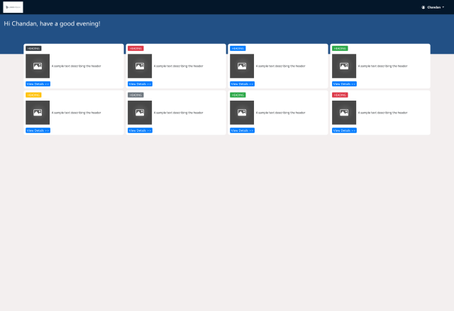
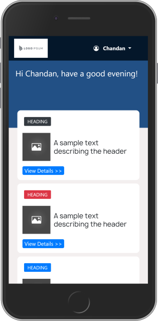

# Edcomfy_studentpage

This student portal page is one of the pages in the School Management System software by the WebDev Group. A software-based school management system helps teachers, administrators, and support staff streamline their daily duties. This page is a dashboard showing the various sections that pertains to each registered student in the school

## Screenshots

## Live Demo

[Hosted Link](https://pensive-hugle-a1aa20.netlify.app)

## Author

Longe Temitope
- Github: [@tamsay](https://github.com/tamsay)
- Twitter: [@longetope](https://twitter.com/longetope)

## 🤝 Contributing

Contributions, issues and feature requests are welcome!

Feel free to check the [issues page](https://github.com/tamsay/Webdev_studentpage/issues)

## Show your support

Give a ⭐️ if you like this project!

## Acknowledgments

Project inspired by WebDev Group